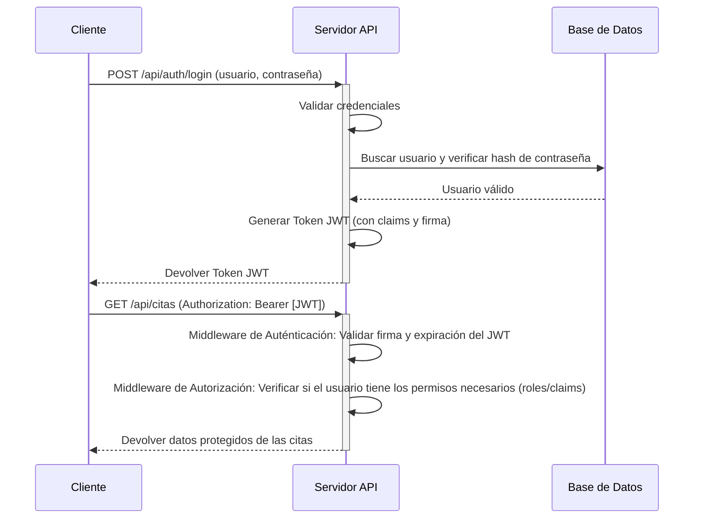

### **INFORME DE AUDITORÍA DE ARQUITECTURA Y CÓDIGO - App_Citas_medicas_backend**

---

### **RESUMEN EJECUTIVO**

*   **Puntuación General:** 2 / 10
*   **Estado de Preparación para Producción:** **NO APTO PARA PRODUCCIÓN.** La aplicación presenta vulnerabilidades de seguridad críticas, fallos arquitectónicos fundamentales y una falta de prácticas modernas que la hacen inestable, insegura y extremadamente difícil de mantener. Su despliegue en un entorno productivo expondría a la organización a un riesgo inaceptable de compromiso de datos y fallos operativos.

*   **Riesgos Críticos Identificados:**
    1.  **Vulnerabilidad de Seguridad CRÍTICA (P0):** Credenciales de la base de datos de producción y del servidor de correo SMTP están hardcodeadas en texto plano directamente en el archivo `Web.config`. Esto permite un acceso no autorizado inmediato y completo a los datos si el código fuente es expuesto.
    2.  **Vulnerabilidad de Seguridad CRÍTICA (P0):** La capa de acceso a datos manual (ADO.NET) no utiliza consultas parametrizadas de forma consistente, lo que crea un riesgo muy alto de ataques de **Inyección de SQL**, permitiendo a un atacante leer, modificar o eliminar toda la base de datos.
    3.  **Vulnerabilidad de Seguridad CRÍTICA (P0):** Ausencia total de autenticación y autorización en los endpoints del API. Cualquier usuario en internet puede acceder, crear, modificar y eliminar datos sensibles (citas médicas, información de pacientes y médicos) sin ninguna restricción.

*   **Recomendaciones Prioritarias:**
    1.  **ACCIÓN INMEDIATA:** Eliminar todas las credenciales hardcodeadas del `Web.config`. Utilizar un sistema seguro para la gestión de secretos como Azure Key Vault, HashiCorp Vault, o como mínimo, transformaciones de configuración y variables de entorno en el servidor de despliegue.
    2.  **ACCIÓN INMEDIATA:** Refactorizar toda la lógica de acceso a datos para usar **consultas parametrizadas** de forma obligatoria y exclusiva, mitigando el riesgo de Inyección de SQL.
    3.  **REQUERIDO ANTES DE PRODUCCIÓN:** Implementar un mecanismo robusto de autenticación y autorización (ej. ASP.NET Identity con JWT) para proteger todos los endpoints del API.
    4.  **ARQUITECTURA:** Reemplazar la implementación manual y propensa a errores de ADO.NET con un ORM moderno como **Entity Framework Core**. Esto mejorará la productividad, seguridad y mantenibilidad.
    5.  **DISEÑO:** Refactorizar la arquitectura para introducir una separación de responsabilidades clara (ej. Capa de Servicios, Patrón Repositorio) y utilizar **Inyección de Dependencias** para desacoplar los componentes y permitir la realización de pruebas unitarias.

---

### **DIAGRAMAS VISUALES DE ARQUITECTURA**

Para complementar el análisis, se han generado los siguientes diagramas que ilustran visualmente el estado actual de la arquitectura del sistema y la arquitectura recomendada para resolver los problemas de diseño fundamentales.

*Nota: Los diagramas se proporcionan en formato de texto [Mermaid](https://mermaid-js.github.io/mermaid-live-editor/). Este código puede pegarse en cualquier editor compatible (como GitHub, GitLab, VS Code con extensiones, o el editor en línea de Mermaid) para generar la imagen visual.*

---

#### **1. Diagrama de la Arquitectura Actual (Anti-patrón: Transaction Script)**

Este diagrama muestra la estructura actual de la aplicación. Se puede observar una dependencia directa y rígida desde la capa de presentación (Controladores) hasta la capa de datos (`*Data` y `ConexionBD`).

**Problemas Clave Visualizados:**
-   **Alto Acoplamiento:** Los componentes están fuertemente acoplados. Un cambio en la base de datos impacta directamente en todas las capas.
-   **Falta de Capas:** No existe una capa de lógica de negocio o de servicio. La lógica está mezclada entre los controladores y las clases de datos.
-   **Intestabilidad:** El uso de métodos estáticos y la dependencia directa hacen que sea imposible realizar pruebas unitarias del controlador sin depender de la base de datos real.

```mermaid
graph TD
    subgraph "Navegador/Cliente"
        U[Usuario]
    end

    subgraph "Servidor (App_Citas_medicas_backend)"
        C[API Controller <br> CitasController.cs]
        D[Clase de Datos Estática <br> CitaData.cs]
        DBM[Gestor de Conexión <br> ConexionBD.cs]
    end

    subgraph "Base de Datos"
        DB[(SQL Server)]
    end

    U --> C
    C -->|Llamada a método estático| D
    D -->|Uso directo| DBM
    DBM -->|Ejecuta SQL| DB

    style C fill:#f9f,stroke:#333,stroke-width:2px
    style D fill:#f9f,stroke:#333,stroke-width:2px
    style DBM fill:#f9f,stroke:#333,stroke-width:2px

    linkStyle 1 stroke-width:2px,fill:none,stroke:red;
    linkStyle 2 stroke-width:2px,fill:none,stroke:red;

    note "Nota: Alto Acoplamiento. El Controlador depende directamente de la implementación de acceso a datos."
```

---

#### **2. Diagrama de la Arquitectura Propuesta (Clean Architecture)**

Este diagrama ilustra la arquitectura recomendada, basada en los principios de Clean Architecture. La regla principal es que las dependencias fluyen hacia adentro, hacia las políticas de negocio del dominio, protegiéndolas de los detalles de implementación externos como la base de datos o la UI.

**Beneficios de este Diseño:**
-   **Bajo Acoplamiento:** Los controladores dependen de abstracciones (interfaces), no de implementaciones concretas.
-   **Separación de Responsabilidades:** Cada capa tiene un propósito claro:
    -   **Presentación:** Gestiona las solicitudes HTTP.
    -   **Aplicación:** Orquesta los casos de uso.
    -   **Dominio:** Contiene la lógica y entidades de negocio más importantes.
    -   **Infraestructura:** Proporciona las implementaciones técnicas (acceso a BD, envío de correos, etc.).
-   **Alta Testabilidad:** Se pueden realizar pruebas unitarias de la capa de Aplicación y Dominio fácilmente, utilizando mocks para las dependencias externas.

```mermaid
graph TD
    subgraph "Cliente"
        U[Usuario]
    end

    subgraph "Capa de Presentación"
        C[API Controller]
    end

    subgraph "Capa de Aplicación"
        S[Servicio de Aplicación <br> ICitaService]
    end

    subgraph "Capa de Dominio"
        E[Entidades / Modelos]
        IR[Interfaces de Repositorio <br> ICitaRepository]
    end

    subgraph "Capa de Infraestructura"
        R[Implementación del Repositorio <br> CitaRepository]
        ORM[Entity Framework Core]
        DB[(SQL Server)]
    end

    U --> C
    C -->|Inyección de Dependencias| S
    S -->|Inyección de Dependencias| IR
    S --> E

    R -->|Implementa| IR
    R --> ORM
    ORM --> DB

    style C fill:#ccf,stroke:#333,stroke-width:2px
    style S fill:#ccf,stroke:#333,stroke-width:2px
    style IR fill:#ccf,stroke:#333,stroke-width:2px

    linkStyle 1 stroke-width:2px,fill:none,stroke:green;
    linkStyle 2 stroke-width:2px,fill:none,stroke:green;

    note "Nota: Bajo Acoplamiento. Las dependencias apuntan hacia adentro, promoviendo la testabilidad y mantenibilidad."
```

---

#### **3. Diagrama del Flujo de Auténticación JWT Propuesto**

Para solucionar la vulnerabilidad crítica de la falta de seguridad, se recomienda implementar un flujo de autenticación basado en JSON Web Tokens (JWT). Este diagrama de secuencia describe el proceso.

**Pasos del Flujo:**
1.  **Login:** El cliente envía sus credenciales (usuario/contraseña) a un endpoint de login.
2.  **Validación y Creación de Token:** El servidor valida las credenciales contra la base de datos. Si son correctas, genera un JWT firmado que contiene información del usuario (claims).
3.  **Almacenamiento del Token:** El servidor devuelve el JWT al cliente, quien debe almacenarlo de forma segura (e.g., en memoria o `localStorage`).
4.  **Acceso a Rutas Protegidas:** Para acceder a un recurso protegido, el cliente debe incluir el JWT en la cabecera `Authorization` de cada solicitud.
5.  **Validación del Token en el Servidor:** El servidor utiliza un middleware para validar la firma y la fecha de expiración del token en cada solicitud. Si es válido, permite el acceso al recurso.



---

### **ANÁLIS DETALLADO POR CATEGORÍA**

#### 1. ANÁLISIS DE CÓDIGO Y CALIDAD
- ✅ **Puntos fuertes**:
  - El código es relativamente simple y fácil de seguir en su flujo procedural.
  - La nomenclatura de clases y métodos es, en general, clara y sigue las convenciones de C# (PascalCase, camelCase).
- ⚠️ **Problemas identificados**:
  - **Problema**: Uso extensivo de clases y métodos estáticos (`CitaData`, `UsuarioData`) para la lógica de negocio y acceso a datos.
    - **Archivo/Línea**: `Controllers/CitasController.cs` (e.g., L23: `CitaData.ListarCitas();`), `Data/CitaData.cs`.
    - **Impacto**: **Alto**. Este es un anti-patrón que impide la inyección de dependencias, lo que hace que el código sea extremadamente difícil de probar (imposible realizar pruebas unitarias) y mantener. Fomenta un acoplamiento muy alto.
    - **Recomendación**: Convertir las clases `*Data` en servicios instanciables que implementen interfaces (e.g., `ICitaService`) y utilizar un contenedor de Inyección de Dependencias.
  - **Problema**: Violación del Principio de Responsabilidad Única (SRP) en la clase `ConexionBD`.
    - **Archivo/Línea**: `Data/ConexionBD.cs`.
    - **Impacto**: **Medio**. La clase maneja la creación de conexiones, la ejecución de múltiples tipos de comandos (lecturas, escrituras, escalares) y la materialización de resultados en diferentes formatos (`SqlDataReader`, `DataTable`). Esto la hace poco cohesiva y difícil de modificar.
    - **Recomendación**: Abstraer el acceso a datos detrás de un patrón Repositorio y utilizar un ORM como Entity Framework Core para que maneje la lógica de bajo nivel de conexión y ejecución de comandos.
- 📊 **Métricas**:
  - **Complejidad Ciclomática**: Baja en los controladores, pero la complejidad real está oculta en la gestión manual de ADO.NET, que es intrínsecamente propensa a errores.

#### 2. ARQUITECTURA Y DISEÑO
- ✅ **Puntos fuertes**:
  - Existe una separación básica de conceptos en carpetas (`Controllers`, `Models`, `Data`), lo que demuestra una intención inicial de organizar el código.
- ⚠️ **Problemas identificados**:
  - **Problema**: Arquitectura anémica de "Transaction Script". No hay una separación clara de capas. Los controladores llaman directamente a la capa de datos.
    - **Archivo/Línea**: `Controllers/CitasController.cs` (e.g., L23).
    - **Impacto**: **Alto**. El acoplamiento entre la capa de presentación (API) y la capa de datos es máximo. La lógica de negocio está dispersa entre los controladores y las clases de datos, lo que hace que el sistema sea rígido y frágil.
    - **Recomendación**: Implementar una arquitectura limpia (Clean/Onion Architecture) introduciendo una **capa de Servicios/Aplicación** para orquestar la lógica de negocio, desacoplando así los controladores de los detalles de la implementación de la base de datos.
  - **Problema**: Ausencia total de Inyección de Dependencias (DI).
    - **Impacto**: **Alto**. Este es uno de los problemas más graves, ya que es la causa principal de la falta de testability y el alto acoplamiento en toda la aplicación.
    - **Recomendación**: Introducir un contenedor de DI. Dado que el proyecto es .NET Framework, se podría usar una librería como `Autofac` o `Ninject`. Sin embargo, la recomendación principal es **migrar a ASP.NET Core**, que tiene un contenedor de DI de primera clase integrado.
  - **Problema**: Falta de patrones de diseño como Repositorio o Unit of Work.
    - **Impacto**: **Alto**. La lógica de negocio está completamente ligada a la implementación de ADO.NET. Un cambio en la forma de acceder a los datos (e.g., migrar a un ORM) requeriría reescribir la aplicación casi por completo.
    - **Recomendación**: Implementar el patrón Repositorio (`ICitaRepository`) para abstraer las operaciones de datos.

#### 3. RENDIMIENTO Y OPTIMIZACIÓN
- ✅ **Puntos fuertes**:
  - El uso de procedimientos almacenados puede ser beneficioso para el rendimiento si están bien optimizados en la base de datos.
- ⚠️ **Problemas identificados**:
  - **Problema**: Gestión de conexiones de BD peligrosa que lleva a **fugas de conexión** (connection leaks).
    - **Archivo/Línea**: `Data/ConexionBD.cs` (Método `Consultar` y `AbrirConexionParaReader`).
    - **Impacto**: **Alto**. El método `Consultar` abre una conexión y espera a que una clase externa llame a `CerrarConexion`. Si esta llamada se omite (lo cual es muy fácil en caso de una excepción), la conexión permanece abierta, agotando el pool de conexiones de SQL Server y causando un fallo catastrófico de la aplicación bajo carga.
    - **Recomendación**: **Refactorización crítica**. Todo el código que interactúa con la base de datos DEBE utilizar bloques `using` para `SqlConnection`, `SqlCommand` y `SqlDataReader` para garantizar que los recursos se liberen correctamente, incluso si ocurren errores.
  - **Problema**: Toda la aplicación es **síncrona**.
    - **Impacto**: **Alto**. Las llamadas a la base de datos bloquean el hilo principal del servidor web. Esto limita drásticamente la cantidad de solicitudes concurrentes que la aplicación puede manejar, resultando en una pobre escalabilidad.
    - **Recomendación**: Migrar a `async/await` en toda la pila de llamadas, desde los métodos del controlador hasta las operaciones de base de datos (`ExecuteReaderAsync`, etc.). Esto es mucho más sencillo y natural en ASP.NET Core.
  - **Problema**: No se implementa ninguna estrategia de **caché**.
    - **Impacto**: **Medio**. Datos que raramente cambian, como la lista de especialidades o médicos, se consultan a la base de datos en cada solicitud.
    - **Recomendación**: Implementar una caché en memoria (`MemoryCache`) para datos semi-estáticos.

#### 4. SEGURIDAD
- ⚠️ **Problemas identificados**:
  - **Problema**: **Credenciales hardcodeadas en texto plano**.
    - **Archivo/Línea**: `Web.config` (Líneas 10-11 para SMTP, Línea 15 para la Base de Datos).
    - **Impacto**: **CRÍTICO**. Cualquiera con acceso al código fuente tiene acceso completo a la base de datos de producción y a la cuenta de correo.
    - **Recomendación**: Utilizar un sistema de gestión de secretos como Azure Key Vault o, como mínimo, variables de entorno del servidor.
  - **Problema**: Riesgo muy alto de **Inyección de SQL**.
    - **Archivo/Línea**: `Data/ConexionBD.cs` (El diseño permite la ejecución de texto SQL sin forzar la parametrización).
    - **Impacto**: **CRÍTICO**. Aunque parece que se usan principalmente SPs, la arquitectura no previene que un desarrollador construya una consulta concatenando strings en el futuro, abriendo un agujero de seguridad masivo.
    - **Recomendación**: Utilizar un ORM como EF Core que parametriza todas las consultas por defecto. Si se mantiene ADO.NET, forzar el uso de `SqlParameter` para toda entrada de usuario.
  - **Problema**: **Ausencia total de autenticación y autorización**.
    - **Archivo/Línea**: `Controllers/CitasController.cs` (y todos los demás controladores).
    - **Impacto**: **CRÍTICO**. Los endpoints son públicos y cualquiera puede manipular los datos.
    - **Recomendación**: Implementar ASP.NET Identity con autenticación basada en tokens JWT y decorar todos los endpoints con el atributo `[Authorize]`.
  - **Problema**: **Fuga de información en mensajes de error**.
    - **Archivo/Línea**: `Controllers/CitasController.cs` (Línea 29).
    - **Impacto**: **Bajo**. Se exponen detalles de `SqlException` al cliente, lo que puede dar pistas a un atacante sobre la estructura de la base de datos.
    - **Recomendación**: Implementar un manejador de excepciones global que loguee los detalles y devuelva un mensaje de error genérico.

#### 5. ESTABILIDAD Y RESILIENCIA
- ⚠️ **Problemas identificados**:
  - **Problema**: **Logging insuficiente y mal implementado**.
    - **Archivo/Línea**: En todo el proyecto se usa `Console.WriteLine`.
    - **Impacto**: **Alto**. En un entorno de producción, estos logs se pierden. Es imposible diagnosticar problemas sin un sistema de logging adecuado.
    - **Recomendación**: Integrar una librería de logging estructurado como **Serilog** o NLog y configurarla para enviar logs a un colector centralizado (Application Insights, Seq, etc.).
  - **Problema**: **Manejo de errores inconsistente**.
    - **Archivo/Línea**: `Data/ConexionBD.cs`.
    - **Impacto**: **Medio**. Algunos métodos devuelven `false` en caso de error mientras que otros lanzan excepciones. Esto hace que el código sea impredecible y difícil de consumir.
    - **Recomendación**: Utilizar una estrategia consistente de lanzar excepciones cuando una operación no puede completarse y manejarlas en las capas superiores.
  - **Problema**: **Falta de patrones de resiliencia**.
    - **Impacto**: **Medio**. La aplicación es frágil ante fallos transitorios de la red o de la base de datos.
    - **Recomendación**: Introducir una librería como **Polly** para implementar políticas de reintento (retry patterns) en las llamadas a la base de datos.

#### 6. TESTING
- ⚠️ **Problemas identificados**:
  - **Problema**: **Cobertura de tests CERO**.
    - **Impacto**: **Alto**. No hay ninguna garantía de que el código funcione como se espera. Cualquier cambio, por pequeño que sea, corre el riesgo de romper funcionalidades existentes sin que nadie se dé cuenta hasta que llega a producción.
    - **Recomendación**: El primer paso es la refactorización hacia una arquitectura testable (con DI). Después, se debe crear un proyecto de tests (usando xUnit o NUnit) y empezar a escribir pruebas unitarias para la lógica de negocio y pruebas de integración para los endpoints.

#### 7. CONFIGURACIÓN Y DEPLOY
- ⚠️ **Problemas identificados**:
  - **Problema**: **Falta de Health Checks**.
    - **Impacto**: **Medio**. Es imposible para herramientas externas (balanceadores de carga, orquestadores) saber si la aplicación está en un estado saludable.
    - **Recomendación**: Añadir un endpoint `/health` que verifique la conectividad con la base de datos. ASP.NET Core tiene un sistema de Health Checks muy robusto.

#### 8. MANTENIBILIDAD
- ⚠️ **Problemas identificados**:
  - **Problema**: **Tecnología Obsoleta (ASP.NET Framework Web API 2)**.
    - **Impacto**: **Alto**. El proyecto está construido sobre una tecnología antigua que carece de las mejoras de rendimiento, seguridad y características de desarrollo de su sucesor, ASP.NET Core. Esto dificulta la contratación de desarrolladores y la adopción de prácticas modernas.
    - **Recomendación**: El objetivo a medio plazo debería ser **migrar el proyecto a .NET 6 (o superior) y ASP.NET Core**.
  - **Problema**: **Falta de Documentación**.
    - **Impacto**: **Bajo**. No hay `README.md` ni documentación de la API (e.g., Swagger), lo que aumenta la curva de aprendizaje para nuevos desarrolladores.
    - **Recomendación**: Añadir un `README.md` detallado y generar documentación de la API usando `Swashbucle` (fácil de integrar en ASP.NET Core).

---

### **PLAN DE ACCIÓN PRIORIZADO**

#### 1. CRÍTICO (Resolver Inmediatamente - Riesgo Existencial para la Aplicación)
1.  **Eliminar Credenciales Hardcodeadas (`Web.config`):**
    *   **Acción:** Mover las connection strings y credenciales SMTP fuera del `Web.config`. Utilizar `appsettings.json` en combinación con el Administrador de secretos de .NET para desarrollo local y Azure Key Vault (o variables de entorno en el servidor) para producción.
    *   **Justificación:** Mitiga el riesgo **CRÍTICO** de exposición de credenciales.
2.  **Implementar Autenticación y Autorización Básica:**
    *   **Acción:** Implementar un sistema de autenticación, por ejemplo, usando ASP.NET Identity con JWT. Añadir el atributo `[Authorize]` a todos los controladores como medida de bloqueo inicial.
    *   **Justificación:** Mitiga el riesgo **CRÍTICO** de acceso no autorizado a todos los datos de la aplicación.
3.  **Corregir Fugas de Conexión a la Base de Datos:**
    *   **Acción:** Refactorizar **inmediatamente** todos los métodos en la clase `ConexionBD.cs` y las clases `*Data` para que cada operación que use `SqlConnection`, `SqlCommand` y `SqlDataReader` esté envuelta en un bloque `using`.
    *   **Justificación:** Previene el agotamiento del pool de conexiones, que causa caídas catastróficas del sistema bajo carga.

#### 2. ALTO (Resolver Antes del Lanzamiento a Producción)
1.  **Migrar el Acceso a Datos a Entity Framework Core:**
    *   **Acción:** Reemplazar por completo la implementación manual de ADO.NET. Crear un `DbContext` de EF Core, definir los modelos (Entities) y usar LINQ para las consultas. Esto elimina por diseño el riesgo de Inyección SQL.
    *   **Justificación:** Mejora drásticamente la seguridad, la mantenibilidad y la productividad del desarrollador.
2.  **Implementar Arquitectura Limpia (Clean Architecture):**
    *   **Acción:** Crear nuevos proyectos de librería (`.csproj`) para las capas `Core` (Entidades, Interfaces), `Application` (Servicios, Lógica de negocio) e `Infrastructure` (Implementación de EF Core). Refactorizar el código actual para que se ajuste a esta estructura.
    *   **Justificación:** Desacopla los componentes, permite la testabilidad y establece una base sólida para el crecimiento futuro de la aplicación.
3.  **Configurar Inyección de Dependencias (DI):**
    *   **Acción:** Configurar el contenedor de servicios de ASP.NET Core (`Program.cs` o `Startup.cs`) para registrar las nuevas interfaces y servicios (e.g., `services.AddScoped<ICitaRepository, CitaRepository>();`). Inyectar las dependencias en los constructores de los controladores.
    *   **Justificación:** Habilita las pruebas unitarias y sigue las mejores prácticas de desarrollo de software moderno.
4.  **Implementar Logging Estructurado:**
    *   **Acción:** Integrar Serilog. Configurar un `Logger` para que escriba en la consola durante el desarrollo y en un sistema centralizado (como Azure Application Insights, Seq o un archivo JSON) en producción. Reemplazar todos los `Console.WriteLine` con llamadas al logger.
    *   **Justificación:** Proporciona la visibilidad necesaria para diagnosticar y resolver problemas en producción.

#### 3. MEDIO (Mejorar en Próximos Sprints)
1.  **Escribir Pruebas Unitarias y de Integración:**
    *   **Acción:** Crear un proyecto de pruebas (xUnit/NUnit). Escribir pruebas unitarias para la lógica de negocio en la capa de aplicación y pruebas de integración para los endpoints del API.
    *   **Justificación:** Asegura la calidad del código, previene regresiones y permite refactorizar con confianza.
2.  **Convertir Operaciones a `async/await`:**
    *   **Acción:** Refactorizar los métodos de los controladores y servicios para que sean asíncronos (`async Task<IActionResult>`) y usar las versiones asíncronas de los métodos de EF Core (e.g., `ToListAsync()`, `SaveChangesAsync()`).
    *   **Justificación:** Mejora significativamente la escalabilidad y el rendimiento de la aplicación al no bloquear hilos del servidor.
3.  **Implementar Validación de Modelos con Data Annotations:**
    *   **Acción:** Añadir atributos de validación (`[Required]`, `[StringLength]`, etc.) a las propiedades de los modelos de entrada (DTOs). Eliminar la lógica de validación manual de los controladores.
    *   **Justificación:** Centraliza y simplifica la lógica de validación, haciendo el código más limpio y declarativo.
4.  **Implementar Documentación de API con Swagger/OpenAPI:**
    *   **Acción:** Añadir el paquete `Swashbucle.AspNetCore` y configurarlo para generar automáticamente una página de documentación interactiva de la API.
    *   **Justificación:** Mejora la mantenibilidad y facilita el consumo de la API por parte de los desarrolladores de frontend u otros clientes.

#### 4. BAJO (Mejoras Continuas)
1.  **Implementar una Estrategia de Caché:**
    *   **Acción:** Utilizar `IMemoryCache` para almacenar en caché datos que cambian con poca frecuencia, como listas de especialidades o médicos.
    *   **Justificación:** Reduce la carga en la base de datos y mejora el tiempo de respuesta.
2.  **Añadir Health Checks:**
    *   **Acción:** Configurar el servicio de Health Checks de ASP.NET Core para exponer un endpoint (`/health`) que verifique el estado de la base de datos.
    *   **Justificación:** Facilita el monitoreo y la orquestación en entornos de contenedores.
3.  **Implementar Patrones de Resiliencia (Polly):**
    *   **Acción:** Integrar Polly para añadir políticas de reintento a las llamadas a la base de datos, haciéndolas más resistentes a fallos transitorios.
    *   **Justificación:** Aumenta la estabilidad y resiliencia de la aplicación.

---

### **HERRAMIENTAS RECOMENDADAS**

-   **Análisis Estático de Código y Calidad:**
    -   **ReSharper (Integrado en Visual Studio):** Es una extensión de productividad esencial. Ayuda a identificar "malos olores" (code smells), sugiere refactorizaciones, mejora la legibilidad del código y refuerza las mejores prácticas en tiempo real mientras se escribe el código.
    -   **SonarQube / SonarCloud:** Plataforma para la inspección continua de la calidad del código. Automatiza la revisión para detectar bugs, vulnerabilidades de seguridad y deuda técnica. Se integra perfectamente en pipelines de CI/CD para evitar que el código de baja calidad llegue a producción.

-   **Análisis de Rendimiento:**
    -   **BenchmarkDotNet:** Es la librería estándar en el ecosistema .NET para realizar benchmarks de rendimiento precisos. Es crucial para medir el impacto de optimizaciones de algoritmos o consultas a la base de datos de manera científica.
    -   **MiniProfiler:** Una librería ligera que permite perfilar el tiempo de ejecución de las consultas a la base de datos directamente desde la aplicación durante el desarrollo. Es excelente para detectar rápidamente consultas N+1 o consultas lentas.

-   **Análisis de Seguridad:**
    -   **Security Code Scan (o Snyk):** Analizadores de Roslyn que se integran en el proceso de build. Escanean el código en busca de patrones de vulnerabilidades de seguridad comunes (como las del OWASP Top 10) y advierten al desarrollador antes de que el código sea subido al repositorio.
    -   **OWASP ZAP (Zed Attack Proxy):** Una herramienta gratuita de pruebas de seguridad de aplicaciones web. Permite realizar pruebas de penetración y escaneo de vulnerabilidades en la aplicación en ejecución para encontrar fallos que el análisis estático podría pasar por alto.

-   **Cobertura de Código de Pruebas:**
    -   **Coverlet / AltCover:** Herramientas de código abierto para medir la cobertura de las pruebas unitarias y de integración. Se integran con el comando `dotnet test` y son esenciales para visualizar qué partes del código están siendo probadas y cuáles no.
    -   **ReportGenerator:** Complementa a Coverlet generando informes HTML visuales y fáciles de navegar a partir de los datos de cobertura, lo que facilita el análisis de los resultados.

-   **Gestión de Dependencias:**
    -   **NuGet Package Manager (Visual Studio):** La herramienta estándar, pero se recomienda habilitar las alertas de seguridad de **GitHub Dependabot** (o Snyk) en el repositorio. Estas herramientas escanean automáticamente las dependencias del proyecto en busca de vulnerabilidades conocidas y crean Pull Requests para actualizarlas.
